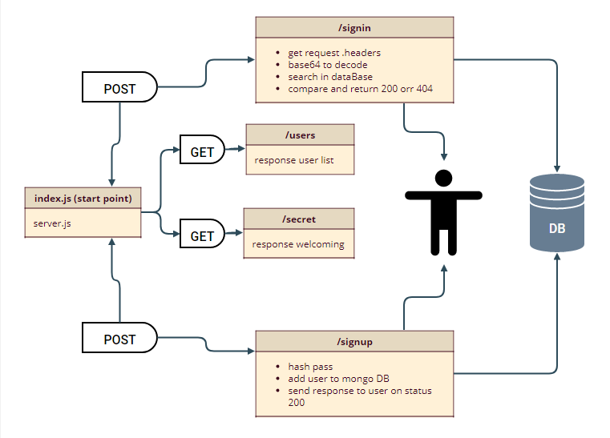

# Lab 7-401 course bearer-auth

## links:
- [heroku link](https://barear-auth-faten.herokuapp.com/)

- [Tests link](https://github.com/Fatensamman/bearer-auth/actions)

- [pull request link](https://github.com/Fatensamman/bearer-auth/pull/1)

## End Points
#### sign up on POST 
-  https://barear-auth-faten.herokuapp.com/signup/

#### sign in on POST basic auth
- https://barear-auth-faten.herokuapp.com/signin/

#### get token on GET bearer-auth
- https://barear-auth-faten.herokuapp.com/users/

#### secret area on GET
- https://barear-auth-faten.herokuapp.com/secret/

## setup  environment

### Install
- initialization using  `npm inint -y`
- install libraries like express dotenv cors morgan  mongo  jsonweptoken 
- install devDependencies like jest supertest eslint @code-fellows/supergoose
- create files tree

 ## Documentation:
 
 